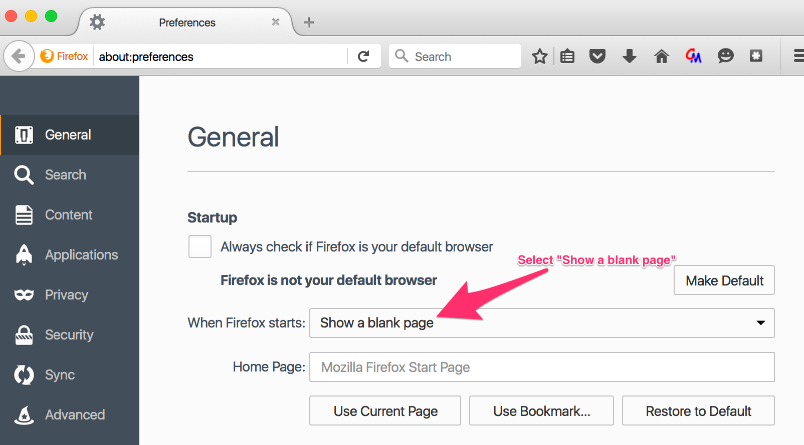
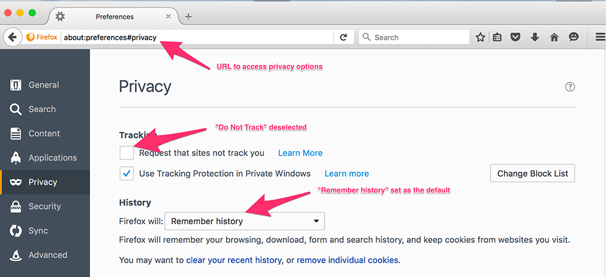

# D. Preparing Firefox for Testing

To prepare to test using Firefox, we need to clear any stored usage data that could potentially affect the results we see when we test. These preparatory steps include clearing the browser cache, all cookies, and all Web history. 

## D1 Set Firefox Home Page

To start, we will make sure that we are not logged in to Sync and that our home page is set to a blank page. To access the home page setting, click the menu icon in the top-right corner of the Firefox window.

If you are logged out of Sync, you will see this reflected in the message in the "Options" box.

<figure>

   
<figcaption>Image Caption: Sync options</figcaption>
</figure>

Click the **Preferences** icon to set your home page. When you are at the home page, set the home page to open to a blank page.

<figure>
  
     
  <figcaption>Image Caption: Preferences options</figcaption>
</figure>

By setting your browser to open to a blank page, you ensure that no extraneous cookies or trackers get set accidentally when you open your browser to start testing.

## D2 Clear History

In the Firefox menu, select **History** --> **Clear recent history**. A pop-up menu appears. Select **Everything** for the time range, tick all the boxes, and click **Clear Now**.

<figure>
  
     
  <figcaption>Image Caption: Clear recent history.</figcaption>
</figure>

## D3 Verify That Cookies Are Allowed and Do Not Track Is Off

During testing, we want to make sure that we accept all cookies and that we are not setting **Do Not Track**. 

**Note**: During regular browsing, we recommend being more selective about the cookies we accept and setting Do Not Track. While many vendors do not respect Do Not Track, it offers a degree of protection.

However, to prepare our browser for testing, enter "about:preferences#privacy" as the URL. 

<figure>
  
     
  <figcaption>Image Caption: For testing, deselect "Do Not Track," and allow all cookies.</figcaption>
</figure>

With our browser set to open to a blank page, old cookies and browsing data removed, and permissions adjusted to allow cookies, we are now set to test.

Additionally, if you are running any adblockers or plug-ins that require HTTPS (examples include HTTPS Everywhere and Privacy Badger), you should disable them on your browser prior to testing. While using extensions like this is recommended for safe browsing, they could limit the range of what we encounter while testing.

* Proceed to the next chapter: E. [Testing Scenarios and Procedures](testing_scenarios.md)
