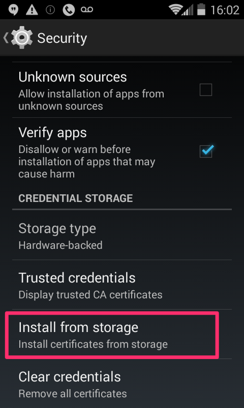
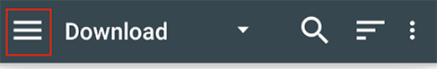

# C. Setting Up the Testing Toolkit

To do basic information security reviews, we first need to get our testing environment set up. This includes preparing our Web browser, any mobile devices we will use to test, and installing some additional software on our local computer.

The tests in this document make extensive use of an [intercepting proxy](glossary.md#h.glossary-intercepting-proxy) to observe, and in some cases modify, the network requests generated by the application under test. There are many proxies and tools that can be used, and the testing scenarios we describe are universal. However, to make the instructions in this handbook as accessible as possible to as many people as possible, our instructions focus on tools that are freely available, and -- ideally -- open source.

While the bulk of our tests rely on an intercepting proxy to power more detailed analysis, two other tools -- a cookie reader, and a browser extension called **Firebug** -- are used as well. These two tools can often be used to do a quick, more cursory examination to determine which additional tests might be necessary.

## Navigation: Getting Started

* C1 [The Toolkit: A Summary](#h.toolkit-summary)
* C2 [Installing and Using Firebug to Observe HTTP and HTTPS Traffic](#h.toolkit-firebug)
* C3 [Installing and Using an Advanced Cookie Manager](#h.toolkit-adv-cookie-manager)
* C4 [Installing and Using a ZAP Proxy to Observe HTTP and HTTPS Traffic](#h.toolkit-zap-proxy)
  * C4.1 [Installation and Initial Setup of OWASP ZAP](#h.toolkit-zap-proxy-install)
  * C4.2 [Basic Setup, Browser and Proxy on Same Computer](#h.toolkit-zap-proxy-same-box)
  * C4.3 [Setup for Testing Mobile Devices and/or Web Browsers on a Different Computer from the Proxy](#h.toolkit-zap-proxy-different-box)
  * C4.4 [Installing Proxy SSL Certificate on Browser and Mobile Devices](#h.toolkit-zap-proxy-ssl-cert)
  * C4.5 [Observing WebSockets Traffic Using a ZAP Proxy](#h.toolkit-zap-proxy-websockets)

## C1 The Toolkit: A Summary

All of the tests documented in the primer are run using:

*   the Firefox browser,
*   with the Firebug extension,
*   and the Advanced Cookie Manager plug-in,
*   and the OWASP Zed Attack Proxy.

Firefox is a free, open-source browser and can be downloaded here: https://www.mozilla.org/en-US/firefox/new/.

Firebug is a browser extension that enables observation of the network requests and responses for Firefox browsing sessions. It can monitor both [http](glossary.md#h.glossary-http) and [https](glossary.md#h.glossary-https) traffic. Because of its straightforward setup and integration with the browser it is a good choice for tests that do not require the extra features of an external proxy such as <a href="https://www.owasp.org/index.php/OWASP_Zed_Attack_Proxy_Project" alt="OWASP Zed Attack Proxy, or ZAP" title="OWASP Zed Attack Proxy, or ZAP">OWASP ZAP</a>.

More information about Firebug can be found at http://getfirebug.com/

Advanced Cookie Manager plugin is a tool that lets us manipulate, inspect, and delete individual [cookies](glossary.md#h.glossary-cookies). More information about the Advanced Cookie Manager is available at https://addons.mozilla.org/en-US/firefox/addon/cookie-manager/

OWASP Zed Attack Prozy, or ZAP, is a freely available, cross-platform and open-source proxy program developed and maintained by [OWASP](https://www.owasp.org) (Open Web App Security Project). It provides more advanced features than Firebug and can be used to monitor the network traffic of mobile devices, as well as programs or browsers running on any host on the tester's local network. ZAP downloads and documentation are available at [the OWASP ZAP project page](https://www.owasp.org/index.php/OWASP_Zed_Attack_Proxy_Project).

This rest of this section describes setting up the proxy and related testing tools, and how to use these tools to perform the tests in this handbook.

* * *

* **Return to** [Navigation: Getting Started](#h.toolkit-nav)

## C2 Installing and Using Firebug to Observe HTTP and HTTPS Traffic

To install Firebug, go to **Tools** --> **Add ons**, search for "Firebug" and select it for installation to Firefox. A screenshot of the plugin's description page (to ensure you are getting the correct plugin) is shown below.

<figure>
  
     
  <figcaption>Image Caption: Firebug Add-on</figcaption>
</figure>

As mentioned above, Firebug is a good choice for tests that don't require the advanced functionality of an external proxy such as OWASP ZAP. After Firebug has been installed, it can be viewed by clicking its icon in the Firefox toolbar. In this setup tutorial, we explain how to use some of the tools that come with Firebug, along with screenshots that show them in action.

The image below shows the Firebug icon in the toolbar, with configuration options that can set user preferences.

<figure>
  
     
  <figcaption>Image Caption: Firebug configuration options</figcaption>
</figure>

The Firebug display is shown below. The **Net** tab shows the network requests and responses; make sure that the **Persist** and **All** options are selected.

<figure>
  
     
  <figcaption>Image Caption: Set the 'Persist' and 'All' options.</figcaption>
</figure>

The **Persist** option prevents the display from being cleared on each new page load. However, Firebug will collapse prior pages in its display, and the tester may need to expand them back out to view the relevant transactions.

In the example below, the user has logged out of a service, and the browsing session prior to the logout has been collapsed.

<figure>
  
     
  <figcaption>Image Caption: Viewing session lists in Firebug.</figcaption>
</figure>

Clicking the highlighted triangle for that portion of the session will expand the display for this part of the session.

<figure>
  
     
  <figcaption>Image Caption: Expanding the session information in Firebug</figcaption>
</figure>

Hovering the mouse over the transaction's entry will show the full URL, enabling a check for [https](glossary.md#h.glossary-https) on the request.

<figure>
  
     
  <figcaption>Image Caption: Getting URL information in Firebug.</figcaption>
</figure>

The transaction's entry can also be expanded by clicking the triangle next to the transaction's entry.

<figure>
  
     
  <figcaption>Image Caption: Using Firebug to get detailed information about a transaction.</figcaption>
</figure>

The descriptions of individual tests in the [testing scenarios](testing_scenarios.md) give more details of how to find the important parts of the request and response in the Firebug display for the test in question. Firebug is a useful tool for initial examinations of web pages, as it can be used to detect basic issues that merit additional testing. If an application opens new browser tabs or views as the user interacts with it, it may be necessary or more straightforward to observe the traffic in an external proxy (such as ZAP, [described below](#h.toolkit-zap-proxy)).

* * *

* **Return to** [Navigation: Getting Started](#h.toolkit-nav)

## C3 Installing and Using an Advanced Cookie Manager

[Cookies](glossary.md#h.glossary-cookies) are small text strings sent by servers to browsers in [HTTP](glossary.md#h.glossary-http) responses as the user interacts with a web service. The browser saves the cookie values and includes them with subsequent HTTP requests to the same application or domain. The use of cookies allows web services to maintain the "state" of a session so that previous interactions can be taken into account when new requests arrive. A cookie editor can be used to examine and modify an application's cookies, and these capabilities are utilized by the test procedures for [authentication cookie](glossary.md#h.glossary-auth-cookie) and Cookie Handling, covered in Section E5 [Authentication token and cookie handling](testing_scenarios.md#testing-auth-token).

Many cookie managers are available as browser plugins. The examples in this document use the **Advanced Cookie Manager** plugin for Firefox. To find it, go to **Tools** --> **Add ons**, search for "cookie managers" and select **Advanced Cookie Manager** for installation to Firefox. A screenshot of the plugin's description page is shown below.

<figure>
  
     
  <figcaption>Image Caption: Advanced Cookie Manager Add on</figcaption>
</figure>

Once installed, the cookie manager can be opened by clicking its icon in the browser add ons toolbar or from the add ons menu. An annotated view of the Advanced Cookie Manager panel is shown below

<figure>
  
     
  <figcaption>Image Caption: Viewing details of cookies in the Advanced Cookie Manager.</figcaption>
</figure>

During several of the tests outlined in the [testing scenarios](testing_scenarios.md), the Cookie Manager will be used to view cookies and their flags, delete cookies, save cookies to file and restore cookies from file. Inspecting cookies is also helpful to learn more about what information is sent to different services on the internet.

* * *

* **Return to** [Navigation: Getting Started](#h.toolkit-nav)

## C4 Installing and Using a ZAP Proxy to Observe HTTP and HTTPS Traffic

As the name implies, an [intercepting proxy](glossary.md#h.glossary-intercepting-proxy) intercepts and logs the requests and responses between a client (browser or mobile app) and the network resources with which it interacts. This enables observation of the behavior of the application without interfering with its functionality.

Setting up a proxy on your computer allows the user to review all network traffic on that computer in greater detail. While Firebug allows the user to see some transactions, an intercepting proxy provides a more comprehensive picture. For example, a portion of a proxy log from loading "graphite.org" in a browser is shown below:

<figure>
  
     
  <figcaption>Image Caption: Sample log output from ZAP Proxy.</figcaption>
</figure>

Once a browser or mobile device has been configured to send traffic to a proxy, the proxy can observe and capture [http](glossary.md#h.glossary-http) (non-encrypted) traffic without additional setup. However, capturing [https](glossary.md#h.glossary-https) traffic requires additional steps. A detailed technical description of https ([SSL](glossary.md#h.glossary-secure-socket-layer)) and [TLS](glossary.md#h.glossary-transport-layer-security) are beyond the scope of this document. However a general description of how a proxy can observe https traffic, along with basic setup steps, is included below.

The normal operation of https creates an [encrypted](glossary.md#h.glossary-encryption) connection between the web browser/app and the resources with which it communicates. Because the traffic is encrypted, the proxy is not able to decipher the encrypted contents of the messages sent or received. To see the encrypted traffic, we must configure the browser or device to "trust" the proxy and allow it to decode the https communication by installing an SSL certificate - generated by the proxy - in the browser or device. This SSL certificate allows the proxy to decrypt the messages as they are received by the user, and then re-encrypt the messages before sending them to the ultimate recipient. The following [diagram from the OWASP ZAP](https://github.com/zaproxy/zap-core-help/blob/master/src/help/zaphelp/contents/images/maninthemiddle.png) [documentation](https://github.com/zaproxy/zap-core-help/blob/master/src/help/zaphelp/contents/images/maninthemiddle.png) (image released under a [CC-SA](http://creativecommons.org/licenses/by-sa/3.0/) license) illustrates the connections between the user, proxy and web resources.

<figure>
  
     
  <figcaption>Image Caption: An overview of OWASP ZAP Proxy.</figcaption>
</figure>

The instructions for setting up OWASP ZAP are broken into five distinct sections:

* C4.1 [Installation and Initial Setup](#h.toolkit-zap-proxy-install)
* C4.2 [Basic Setup, Browser and Proxy on Same Computer](#h.toolkit-zap-proxy-same-box)
* C4.3 [Setup for Testing Mobile Devices and/or Web Browsers on a Different Computer from the Proxy](#h.toolkit-zap-proxy-different-box)
* C4.4 [Installing Proxy SSL Certificate on Browser and Mobile Devices](#h.toolkit-zap-proxy-ssl-cert)
* C4.5 [Observing WebSockets Traffic Using a ZAP Proxy](#h.toolkit-zap-proxy-websockets)

If you are primarily concerned with testing web applications, you will not need to use any of the instructions in C4.3 [Setup for Testing Mobile Devices and/or Web Browsers on a Different Computer from the Proxy](#h.toolkit-zap-proxy-different-box).

If you are going to test mobile apps, then the instructions in C4.3 [Setup for Testing Mobile Devices and/or Web Browsers on a Different Computer from the Proxy](#h.toolkit-zap-proxy-different-box) cover the details of preparing this testing environment.

Using the ZAP Proxy requires more setup steps than other elements of the Toolkit. Fortunately, these steps only need to be completed once. Additionally, in many cases, Firebug can be used to perform initial reviews that can determine whether a more detailed examination via an intercepting proxy is necessary.

### C4.1 Installation and Initial Setup of OWASP ZAP

This primer focuses specifically on the features or ZAP we use for the tests covered in the testing scenarions, which is a small subset of all the features offered in ZAP. For complete overview of the full feature set of ZAP, consult the <a href="https://github.com/zaproxy/zap-core-help/wiki" alt="full ZAP documentation" title="full ZAP documentation">full ZAP documentation</a>.

ZAP is available for download at the ZAP project page:

[https://www.owasp.org/index.php/OWASP_Zed_Attack_Proxy_Project](https://www.owasp.org/index.php/OWASP_Zed_Attack_Proxy_Project)

The download packages and installation instructions are platform-specific for Windows, Apple, and Linux. Choose the **Standard** package and follow the installation instructions for your desired platform.

#### C4.1.1 Modify Display Settings

After installation, modify the **Display** settings to enable **process images in HTTP requests/responses**. This configuration causes image loads that may be of interest during testing to be displayed in the history log. In ZAP this setting is managed in the **Tools** --> **Options** --> **Display** menu.

<figure>
  
     
  <figcaption>Image Caption: Set ZAP Proxy to display images in http requests and responses.</figcaption>
</figure>

Select the checkbox for **Process images in HTTP requests/responses**. Then, click the **OK** button.

* * *

* **Return to** [Navigation: Getting Started](#h.toolkit-nav)
* **Return to** [Navigation: ZAP Proxy Setup](#h.toolkit-zap-nav)

### C4.2 Basic Setup, Browser and Proxy on Same Computer

The most straightforward setup is when the browser and proxy are on the same computer.

#### C4.2.1 ZAP Local Proxy Address

Within ZAP, the local proxy address should be set up as "localhost", and port set to 8080 (this is the default setting at install). In ZAP, this setting is managed in the **Tools** --> **Options** --> **Local proxy** menu.

<figure>
  
     
  <figcaption>Image Caption: Set Local Proxy address.</figcaption>
</figure>

Once you have verified that the settings in ZAP are correct, you can proceed to set the correct configuration in the browser you will use for testing.

#### C4.2.2 Browser Proxy Address

When the browser and the proxy are on the same computer, the proxy address in the browser should be configured to use a proxy at "localhost" and port 8080.

Firefox manages this in **Preferences** --> **Advanced** --> **Network** --> **Connection, as shown below.

<figure>
  
     
  <figcaption>Image Caption: Set proxy address in Firefox.</figcaption>
</figure>

*   Select **Manual proxy configuration**.
*   Set **HTTP Proxy** to "localhost", and **Port** to "8080".
*   Select the option to **Use this proxy server for all protocols**.

Then, click the **OK** button.

To complete the setup, skip ahead to the [C4.4 Installing Proxy SSL Certificate on Browser and Mobile Devices](#h.toolkit-zap-proxy-ssl-cert) section below.

* * *

* **Return to** [Navigation: Getting Started](#h.toolkit-nav)
* **Return to** [Navigation: ZAP Proxy Setup](#h.toolkit-zap-nav)

### C4.3 Setup for Testing Mobile Devices and/or Web Browsers on a Different Computer from the Proxy

The steps in this section are only relevant in the following scenarios:

*   Testing traffic coming from a phone or a tablet
*   Testing traffic coming from multiple computers (for example, if the tests will compare traffic from a Chromebook, an Apple computer, and/or a Windows computer)

If you are not testing mobile devices, and/or if you are running ZAP on the same computer as the web browser you will use for testing, you do not need to follow the steps in this section.

To configure ZAP to support testing with mobile devices, we need to complete two basic steps:

1. Get the address of the computer running ZAP; and
2. Configure all testing devices to use that address. 

The steps in C4.3 outline this process.

#### C4.3.1 Find the Network Address of the Proxy Computer

The first step is to determine the network address of the computer running ZAP Proxy. The procedure is different for Windows, MacOS, and Linux.

When you find the network address of computer running the proxy, write it down and store it in an easily accessible place. This network address needs to be added to other devices that will be used for testing.

##### C4.3.1.1 Windows:

The network address can be found under:

**Control Panel** --> **Network and Internet** --> **Network and Sharing Center**

From this dialog, select the active network, which will bring up a status menu. Select **Details** from this menu.

<figure>
  
     
  <figcaption>Image Caption: Navigating to "Details" for the active network.</figcaption>
</figure>

The **Details** dialog will display the network address of the computer. In almost all cases, the IPv4 address (not the IPv6 address) is the one that should be used as the proxy's network address, as shown below.

<figure>
  
     
  <figcaption>Image Caption: Finding the correct address in Windows.</figcaption>
</figure>

##### C4.3.1.2 Apple OS X:

The network address can be found in **System Preferences** --> **Network**, as shown below.

<figure>
  
     
  <figcaption>Image Caption: Finding the correct address in OS X.</figcaption>
</figure>

##### C4.3.1.3 Linux/Unix:

Many distributions include a System Preferences utility that can be used to find the computer's network address. Another option is to use the 'ip address' command from the shell and look for the 'inet' entry on the appropriate interface, as shown below.

<pre>
<code>
$ ip address
1: lo: &lt;LOOPBACK,UP,LOWER_UP&gt; mtu 65536 qdisc noqueue state UNKNOWN group default 
    link/loopback 00:00:00:00:00:00 brd 00:00:00:00:00:00
    inet 127.0.0.1/8 scope host lo
       valid_lft forever preferred_lft forever
    inet6 ::1/128 scope host 
       valid_lft forever preferred_lft forever
2: eth0: &lt;BROADCAST,MULTICAST,UP,LOWER_UP&gt; mtu 1500 qdisc pfifo_fast state UP group default qlen 1000
    link/ether 00:0c:29:20:f6:c1 brd ff:ff:ff:ff:ff:ff
    inet 192.168.251.211/24 brd 192.168.251.255 scope global eth0
       valid_lft forever preferred_lft forever
    inet6 fe80::20c:29ff:fe20:f6c1/64 scope link 
       valid_lft forever preferred_lft forever
</code>
</pre>

In the example above, **eth0** is the correct interface, and the address is *192.168.251.211*.

#### C4.3.2 In ZAP Proxy: Change "Local proxy" Address

The proxy setup procedure is the same as covered in C4.2 [Basic Setup, Browser and Proxy on Same Computer](#h.toolkit-zap-proxy-same-box), except that the network address of the computer (which we discovered in the prior step) should replace the default addresss setting of **localhost**.

<figure>
  
     
  <figcaption>Image Caption: Updating the local proxy address in ZAP.</figcaption>
</figure>

#### C4.3.3 In Firefox: Change the "Manual proxy configuration" Address

In Firefox, under **Preferences** --> **Advanced** --> **Network** --> **Connection**, select **Manual Proxy** and enter the network address found in the steps above.

Once the settings have been updated, click the "OK" button to save the changes.

<figure>
  
     
  <figcaption>Image Caption: Updating the Proxy address in Firefox.</figcaption>
</figure>

#### C4.3.4 iOS Device Setup

On an iOS (Apple) device go to **Settings** --> **Wifi**, and make sure your device is on the same network as the proxy computer.

Select the info screen for the network the device is connected to.

<figure>
  
     
  <figcaption>Image Caption: Verifying network name in iOS.</figcaption>
</figure>

The proxy settings are at the bottom of the network settings screen. Enable manual proxy settings and enter the network address found in the previous steps, and the port number as shown below.

<figure>
  
     
  <figcaption>Image Caption: Setting the correct address for the proxy in iOS.</figcaption>
</figure>

#### C4.3.5 Android Device Proxy Setup

Open the **Settings** menu and select **Wi-Fi**.

<figure>
  
     
  <figcaption>Image Caption: Selecting the active wireless network in Android.</figcaption>
</figure>

Press and hold the name of the network to bring up the network settings menu, and select **Modify network**.

**NOTE**: You need to give a longer than average "click" on the wireless name, in the range of 1-2 seconds, to bring up the **Modify Network** option.

<figure>
  
     
  <figcaption>Image Caption: Select the Modify Network option.</figcaption>
</figure>

Select **Show advanced options**, and then select **Manual proxy configurations**. Use the network address and port number from step C4.3.1, as illustrated below.

<figure>
  
     
  <figcaption>Image Caption: Setting the proxy address in Android.</figcaption>
</figure>

Click the **Save** link to save the settings.

* * *

* **Return to** [Navigation: Getting Started](#h.toolkit-nav)
* **Return to** [Navigation: ZAP Proxy Setup](#h.toolkit-zap-nav)

### C4.4 Installing Proxy SSL Certificate on Browser and Mobile Devices

Installing the proxy's SSL certificate to browsers and devices will allow the proxy to decrypt the https traffic generated by these clients. In this section, we will cover using ZAP to generate a SSL certificate. Then, we will document how to save this certificate to our testing browser, and/or a mobile device.

#### C4.4.1 Save Proxy Certificate to File

The proxy's SSL certificate can be saved from the **ZAP Preferences** --> **Dynamic SSL Certificates** menu. Open the dialog and click on **Save**.

<figure>
  
     
  <figcaption>Image Caption: Saving the SSL Certificate generated by ZAP.</figcaption>
</figure>

The file will be saved as "owasp_zap_root_ca.cer" in the directory chosen by the user.

#### C4.4.2 Import Proxy Certificate to Browser

In Firefox, certificates can be installed in the **Preferences** --> **Advanced** --> **Certificates** dialog.

Within this dialog select **View Certificates**.

<figure>
  
     
  <figcaption>Image Caption: Accessing installed certificates in Firefox</figcaption>
</figure>

In the **View Certificates** dialog, select **Import**.

<figure>
  
     
  <figcaption>Image Caption: Importing a certificate in Firefox</figcaption>
</figure>

Then, select the root certificate (owasp_zap_root_ca.cer) downloaded from the ZAP Proxy, and open it, as shown in the screenshot below.

<figure>
  
     
  <figcaption>Image Caption: Selecting the certificate.</figcaption>
</figure>

Then, select the option to **Trust this CA to identify websites**, and click the **OK** button.

<figure>
  
     
  <figcaption>Image Caption: Trust the certificate generated by ZAP to identify websites.</figcaption>
</figure>

Verify that the certificate has been uploaded by browsing to it. All Certificate Authorities are listed alphabetically. Once you have verified that the certificate has been uploaded, click the **OK** button.

<figure>
  
     
  <figcaption>Image Caption: Verify that the certificate is imported.</figcaption>
</figure>

**Note**: When you are not testing, you should remove the certificate from the browser.

To remove the certificate, in Firefox go to the **Preferences** --> **Advanced** --> **Certificates** --> **View Certificates** menu, select the *OWASP Zed Attack Proxy Root CA* certificate, and click on **Delete or Distrust**.

<figure>
  
     
  <figcaption>Image Caption: Removing the OWASP ZAP Root CA.</figcaption>
</figure>

#### C4.4.3 Import Proxy Certificate to iOS Device

It is important to take care when transferring the certificate file to the device, as anyone who possesses it could potentially use it to decrypt https communications from devices that install the certificate. While this risk is small, and can be mitigated by uninstalling the certificate when not testing, handling the certificate safely is highly recommended.

##### C4.4.3.1 Transfer Proxy Certificate File to the Device 

A secure file sharing service is one good way to transfer the file. For iOS devices, the file must be accessed from the file sharing service using the browser, not the sharing service's iOS app. Accessing the file from within the browser interface to the sharing service will bring up the **Install Profile** dialog described in the next step of the setup. 

##### C4.4.3.2 Install Proxy Certificate File on the Device

Once the certificate file has been transferred to the device, open it on the device. Opening the file will bring up the **Install Profile** dialog. (iOS refers to certificates with the broader term "Profile"). Select **Install** from within this dialog.

<figure>
  
     
  <figcaption>Image Caption: Select the "Install" option.</figcaption>
</figure>

After a device password check, the **Install Profile** dialog will bring up a second dialog with a warning about installing a certificate to the device. Since the objective is to install the proxy's certificate to allow monitoring of https traffic, it is OK to accept the warning and select **Install**.

<figure>
  
     
  <figcaption>Image Caption: Warning message for OWASP ZAP Root CA.</figcaption>
</figure>

After the certificate is installed, a screen will confirm that the certificate was successfully installed.

<figure>
  
     
  <figcaption>Image Caption: Confirmation screen.</figcaption>
</figure>

Note: to remove the certificate after testing is complete, go to the **Settings** --> **General** menu and scroll down. The certificate will be listed under **Profile**.

<figure>
  
     
  <figcaption>Image Caption: Finding the installed certificate.</figcaption>
</figure>

Select **Profile** to enter a dialog that provides the option to delete the certificate.

<figure>
  
     
  <figcaption>Image Caption: Deleting the certificate.</figcaption>
</figure>

#### C4.4.4 Import Proxy Certificate to Android Device

It is important to take care when transferring the certificate file to the device, as anyone who possesses it could potentially use it to decrypt https communications from devices that install the certificate. While this risk is small, and can be mitigated by uninstalling the certificate when not testing, handling the certificate safely is highly recommended.  

For Android devices, many methods of moving the certificate file to the device's storage (browser, secure file sharing service, direct transfer over USB or a SD card) can be used.

##### C4.4.4.1 Transfer Proxy Certificate File to the Device

Copy the proxy certificate file to the Android's SD card or other internal storage. The tutorial below assumes that certificate has been moved to a SD card. 

##### C4.4.4.2 Install Proxy Certificate File to the Device

This document covers installation for Android versions 4.3 and above. The installation is slightly different for Android 4.3, Android 4.4, and higher. Select the installation that corresponds to your device's Android version.

##### Android 4.3:

In the **Settings** --> **Security** dialog, select **Install from SD Card**.

<figure>
  
     
  <figcaption>Image Caption: Install from SD Card.</figcaption>
</figure>

A dialog titled **Name the Certificate** will pop up. Leave the name unchanged and select **OK**.

<figure>
  
     
  <figcaption>Image Caption: Saving the certificate to an Android 4.3 device.</figcaption>
</figure>

When you are not using the device to test, remove the certificate. To remove the certificate, go to the **Setup** --> **Security** --> **Trusted Credentials** --> **User** dialog.

<figure>
  
     
  <figcaption>Image Caption:</figcaption>
</figure>

Select the OWASP certificate to bring up another menu with an option to remove the certificate.

<figure>
  
     
  <figcaption>Image Caption: Finding and selecting the certificate.</figcaption>
</figure>

Tapping the **Remove** button uninstalls the certificate.

##### Android 4.4 and higher:

In the **Settings** --> **Security** dialog, select **Install from Storage**.

<figure>
  
     
  <figcaption>Image Caption: Install from storage.</figcaption>
</figure>

A dialog showing the downloads directory will show up. However, the process usually requires the certificate to be accessed through **Internal Storage** instead, using the following sequence:

Select the menu tab at top left corner.

<figure>
  
     
  <figcaption>Image Caption: Access internal storage.</figcaption>
</figure>

Select **Internal Storage** from the menu.

<figure>
  
     
  <figcaption>Image Caption: Select internal storage.</figcaption>
</figure>

Select the **Download** directory from the **Internal Storage** choices.

<figure>
  
     
  <figcaption>Image Caption: Select the correct directory.</figcaption>
</figure>

Select the certificate file.

<figure>
  
     
  <figcaption>Image Caption: Select the certificate file.</figcaption>
</figure>

A dialog titled **Name the Certificate** will pop up. Enter a name, leave **Credential Use** set to *VPN and apps* and select **OK** to install the certificate. 

**NOTE**: If the device does not have a screen lock pin or passcode, a window will pop up requiring one to be set.

<figure>
  
     
  <figcaption>Image Caption:</figcaption>
</figure>

When you are not using the device to test, remove the certificate. To remove the certificate, go to **Setup** --> **Security** --> **Clear Credentials**.

<figure>
  
     
  <figcaption>Image Caption: Clear credentials.</figcaption>
</figure>

Click **OK** to clear credentials. Only the user-installed credentials are cleared.

<figure>
  
     
  <figcaption>Image Caption: Provide the OK to clear credentials. Only user-uploaded credentials are cleared.</figcaption>
</figure>

* * *

* **Return to** [Navigation: Getting Started](#h.toolkit-nav)
* **Return to** [Navigation: ZAP Proxy Setup](#h.toolkit-zap-nav)

### C4.5 Observing WebSockets Traffic Using a ZAP Proxy

Websockets is a communication link separate from HTTP that browsers and application servers can use to pass information back and forth. It is normally a secondary form of communication that is connected after the web application loads into the browser. If an application uses websockets, the traffic is of interest for security testing because it may contain personal information of the account holder or other users of the system.

ZAP Proxy supports the viewing of websockets traffic. (Note: Firebug does not support viewing of websockets traffic). By default the websockets pane is not one of the choices shown in the toolbar at the center of the ZAP display.

The websockets pane can be added by clicking the green "+" and selecting **WebSockets** from the dropdown menu.

<figure>
  
     
  <figcaption>Image Caption: Enabling the WebSockets pane.</figcaption>
</figure>

The pane will also be added automatically to the toolbar by ZAP if a websockets connection is opened through the proxy. A view of the websockets traffic pane is shown below. Clicking on an individual message will show the full payload of the message in the upper pane of ZAP (where HTTP requests and responses are normally shown).

From the websockets view, it is also possible to determine whether the websockets traffic is sent over an encrypted connection. The steps for checking whether the traffic is encrypted are detailed in Section E8 [Observation of websockets traffic](testing_scenarios.md#h.testing-websockets).

<figure>
  
     
  <figcaption>Image Caption: Observing websockets traffic in ZAP.</figcaption>
</figure>

* * *

* **Return to** [Navigation: Getting Started](#h.toolkit-nav)
* **Return to** [Navigation: ZAP Proxy Setup](#h.toolkit-zap-nav)
* Proceed to the next chapter: D. [Preparing Your Browser](browser_prep.md)
