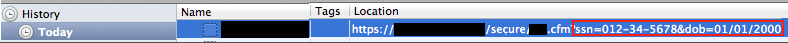
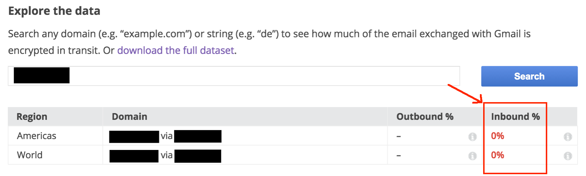

# E. Testing Scenarios and Procedures

When the testing environment setup is complete, testing can begin on various elements of websites and applications. The testing scenarios described in the rest of this handbook focus on common issues with Web and mobile applications.

For people who want to learn more about basic information security but who won't get into running specific tests, the "Summary" and "Exploitability and Impact" sections provide an overview of when and how a specific vulnerability could be exploited. The "Setup and Tests" section covers the specific steps to identify any potential security holes.

Not all issues are equally serious, and the possible risk of any issue needs to be weighed against the specific use of the application. In each test section, there is a discussion of the ease of exploiting the vulnerability and the potential [impact](glossary.md#h.glossary-impact) of a successful [exploit](glossary.md#h.glossary-exploit). Not every test will be applicable in every situation. Additionally, in some testing scenarios, initial tests will be used to determine whether more detailed tests are necessary.

Every test scenario uses a common structure:

*   Summary
*   Exploitability and Impact
*   Setup and Tests

Most of the descriptions below assume that you are using Firebug or ZAP Proxy to examine traffic sent over the Internet between the application being tested and the vendor's servers.

## <a name="h.testing-nav">Navigation: Testing Scenarios and Procedures

* E. [Testing Scenarios and Procedures](testing_scenarios.md)
  * E1 [Sensitive Information in URLs](testing_scenarios.md#h.testing-url-info)
  * E2 [Encryption and Transport Layer Security](testing_scenarios.md#h.testing-tls)
  * E3 [TLS for Email Sent by an Application to Users](testing_scenarios.md#h.testing-email-tls)
  * E4 [Caching and History Storage of Pages with Sensitive Information](testing_scenarios.md#h.testing-cache)
  * E5 [Authentication Token and Cookie Handling](testing_scenarios.md#h.testing-auth-token)
  * E6 [Password Handling](testing_scenarios.md#h.testing-password)
  * E7 [Username Enumeration](testing_scenarios.md#h.testing-username)
  * E8 [Observation of WebSockets Traffic](testing_scenarios.md#h.testing-websockets)
  * E9 [Information Leakage](testing_scenarios.md#h.testing-leakage)
  * E10 [API Authentication Checks](testing_scenarios.md#h.testing-api)
  * E11 [Mobile Application Testing](testing_scenarios.md#h.testing-mobile)

# E1 Sensitive Information in URLs

## E1.1 Summary

It is common practice to include parameters in URLs sent from applications to the network servers hosting the applications. In many cases this is benign, but if sensitive information is included in URLs, it can pose a security risk for the application's users.

## E1.2 Exploitability and Impact

Inclusion of non-sensitive information or parameters in URLs does not pose a security risk. For example, encoding a page ID in a URL is a common practice that does not expose sensitive information.

<figure>
  
     
  <figcaption>Image Caption: A page ID revealed in a URL. This is not generally a security issue.</figcaption>
</figure>

Timestamps and character encodings are other non-sensitive uses of URL parameters.

<figure>
  
     
  <figcaption>Image Caption: A timestamp and character encoding (UTF-8) included in a URL. This is not generally a security issue.</figcaption>
</figure>

However, including sensitive or personal information in a URL can put this information at risk of unintentional disclosure. In the example below, a user's username and password has been placed in a URL during a mobile application authentication process.

<figure>
  
     
  <figcaption>Image Caption: A username and password shared in a URL. This creates a security risk.</figcaption>
</figure>

Here, a user's personal information is part of the URL.

<figure>
  
     
  <figcaption>Image Caption: Date of birth and Social Security number in a URL</figcaption>
</figure>

Sensitive information in URLs may be captured by a browser's history and in its cache (examining your browser cache is covered in [Caching and History Storage of Pages with Sensitive Information](#h.testing-cache) later in this document). Sensitive information can also be captured in server logs or other access logs. The screen captures below show that the example above with SSN and date of birth have been captured in the browser history and cache.

<figure>
  
     
  <figcaption>Image Caption: The same date of birth and Social Security number, stored in the browser history</figcaption>
</figure>

<figure>
  
     
  <figcaption>Image Caption: The same date of birth and Social Security number, stored in the local cache</figcaption>
</figure>

This security issue poses an immediate risk on a shared computer, where another user could access it. Additionally, URLs containing sensitive information may be [snooped](glossary.md#h.glossary-snooping) from unencrypted network traffic or recorded by servers that implement or interact with the application.

Apps that use [https](glossary.md#h.glossary-https) eliminate the snooping vulnerability, but an application's own servers may log URLs received from or accessed by users. If the connection uses https, intentional misuse of URL information collected for legitimate purposes is not a significant concern, but when sensitive information is sent in URLs and logged by servers, it creates a risk that this data could be compromised via human error or a data breach.

Additionally, many applications utilize third-party analytics services to track user activity for the purposes of improving the application and understanding its usage patterns. Sensitive information in URLs may be sent to analytics or other third-party services in the "Referer" field of messages. In the image below, a URL containing a valid account access code is sent to an analytics service.

<figure>
  
     
  <figcaption>Image Caption: Sensitive information in the URL being sent to a third party</figcaption>
</figure>

Some services that protect users from malicious websites send some of a user's browsed URLs to their servers for analysis. In the example below, one such service sent a URL containing a user's username and password to its servers.

<figure>
  
     
  <figcaption>Image Caption: Sensitive user information being sent to a third-party analytics company.</figcaption>
</figure>

There are many other secure ways to pass on sensitive information, so including any sensitive information in a URL is generally an unneeded risk.

## E1.3 Setup and Tests

There is not a specific test for sensitive information in URLs. The tester should use the application in a typical fashion and examine proxy logs for any sensitive information. The login sequence is an important part to examine closely, but other transactions may contain sensitive information in URLs. Examine the traffic using either Firebug (for quick examinations and evaluations) or ZAP Proxy (for more detailed analysis).

Often, when performing an initial evaluation of an app, the process of creating an account, updating a profile, creating content, and logging out can highlight areas that could require additional review. Performing these basic actions and reviewing the logs in ZAP or Firebug can indicate areas that are potentially troublesome.

* * *

* **Return to** [Navigation: Testing Scenarios and Procedures](#h.testing-nav)

# E2 Encryption and Transport Layer Security

## E2.1 Summary

[Encryption](glossary.md#h.glossary-encryption) and [transport layer security](glossary.md#h.glossary-transport-layer-security) are among the fundamental components of securing applications and the information they transmit and store. Encryption converts information into an unintelligible form that can only be decoded (or "decrypted") by a recipient who holds the code required to reverse the encryption. "Transport layer" is a technical term for the mechanisms and pathways used to transmit information between a user and an Internet service. "Transport layer security" (or TLS), as the name implies, refers to the suite of protocols and techniques used to protect the security, privacy, and integrity of Internet communications. TLS is often also called "SSL" ([secure socket layer](glossary.md#h.glossary-secure-socket-layer)), particularly when used with browser and application communications. Strictly speaking, SSL is a precursor of TLS, but the terms are commonly used interchangeably. To be consistent with other documentation and discussion, this document uses "SSL" in contexts where it is typically called SSL (such as browser traffic with a server), and "TLS" elsewhere.

TLS protects the integrity of Internet communications in two important ways: Adding trust that the messages are coming from the authentic source and have not been tampered with, and protecting the privacy of the message contents from others who may access network traffic.

The [certificate](glossary.md#h.glossary-certificate) mechanism creates a registration system that adds trust that the Internet service is not being impersonated by someone else. There are also message integrity checks that protect against someone tampering with the message between the sender and receiver. (This is known as a [man-in-the-middle attack](glossary.md#h.glossary-man-in-the-middle) attack). In most cases these checks are implemented within the browser or mobile app and are not easily observed by end users.

TLS uses encryption to protect sensitive data from unauthorized viewing by those who can observe network traffic. A common situation where encryption is important is a shared Wi-Fi hotspot such as a coffeehouse, an airport, or a public library. Communications sent without encryption can be captured and freely read by others who are on the same network. For example, without TLS, a user's login ID and password could be [snooped](glossary.md#h.glossary-snooping) by someone on the network, or a user's [authentication cookie](glossary.md#h.glossary-auth-cookie) could be stolen and used in a [session-hijacking](glossary.md#h.glossary-session-hijack) attack that allows an adversary to take control of someone's account (more information on authentication and [cookies](glossary.md#h.glossary-cookies) is included in section E5 [Authentication Token and Cookie Handling](testing_scenarios.md#h.testing-auth-token)).

Using a browser, a user can check whether https is in use by looking at a Web page's URL. If the URL starts with *https://*, then the site is using a secure connection; if it begins with *http://*, it is not. This is a good basic check, but proxy logs of all of the application's requests must be examined (as described in this section) to get the full measure of https usage by an application.

In an educational setting, [transport layer security](glossary.md#h.glossary-transport-layer-security) is a necessity in many -- but not all -- situations. Services that collect a username, a password, or any other potentially sensitive information should always use TLS. However, an application that doesn't require a login -- such as a publicly available online calculator that collects no personal information -- could be used safely without TLS. In general, though, given the ease with which TLS can be implemented, it is a good thing to look for.

## E2.2 Exploitability and Impact

[Snooping](glossary.md#h.glossary-snooping) of unencrypted network traffic can be accomplished with cursory technical knowledge and off-the-shelf computers or with computers with inexpensive specialized network adapters. Programs exist to automate the process of extracting authentication tokens and other unencrypted traffic.

[Man-in-the-middle](glossary.md#h.glossary-man-in-the-middle) attacks -- such as tampering with unencrypted login forms or presenting false SSL certificates to mobile apps -- require much more skill and effort on the part of the attacker. The impact of data exposure from a successful exploit of transport layer security can be significant; an adversary who can view network traffic may directly snoop sensitive information from the network communications or may extract passwords or authentication codes that allow access and control of the account itself.

## E2.3 Setup and Tests

### E2.3.1 Tools

The TLS checks for Web applications can be performed with a browser and proxy. The TLS checks for mobile apps can be performed with the mobile app and proxy. Refer to the setup instructions in Section C4 [Installing and Using ZAP Proxy to Observe HTTP and HTTPS Traffic](getting_started.md#h.toolkit-zap-proxy) for information on how to configure the tools.

### E2.3.2 Tests

#### E2.3.2.1 Check Whether the Login Form or Page Is Served Using HTTPS (Web Applications)

Load the login page and examine the transactions in the proxy to check whether or not the login page is loaded via https. Lack of https on login forms can enable man-in-the-middle attacks that tamper with the form.

In the example below, the page is loaded without https:

<figure>
  
     
  <figcaption>Image Caption: Page loaded without https, displayed in ZAP</figcaption>
</figure>

In this example, the page is loaded with https:

<figure>
  
     
  <figcaption>Image Caption: Page loaded with https, displayed in ZAP</figcaption>
</figure>

Here a page loaded with http is displayed in Firebug:

<figure>
  
     
  <figcaption>Image Caption: Page loaded without https, displayed via Firebug</figcaption>
</figure>

#### E2.3.2.2 Check Whether Login Credentials Are Posted Using HTTPS (Web Applications and Mobile Apps)

Submit a login attempt and examine the transaction in the proxy.

In this example the credentials are submitted without https:

<figure>
  
     
  <figcaption>Image Caption: Username and password sent without https</figcaption>
</figure>

In the following example, the credentials are submitted with https:

<figure>
  
     
  <figcaption>Image Caption: Username and password sent securely, with https</figcaption>
</figure>

#### E2.3.2.3 Check Whether Authenticated Sessions Continue to Use HTTPS After Login (Both Web Applications and Mobile Apps)

Some applications will use https for the login but then switch to http after the login is complete, exposing private information and authentication tokens to the risk of network snooping. After logging into an application, examine the transactions that come after the login to see if they are using https.

The examples below use http after login, exposing the user's authentication cookies to the risk of network snooping. This issue can be seen using either ZAP or Firebug.

In ZAP:

<figure>
  
     
  <figcaption>Image Caption: A session sent without https that exposes the authentication cookie</figcaption>
</figure>

In Firebug:

<figure>  
     
  <figcaption>Image Caption: A session sent without https that exposes the authentication cookie</figcaption>
</figure>

In the next screenshot, we see an example of a service that uses https after login, protecting the user information and authentication cookies included in the responses. Note how the URL begins with "https."

<figure>
  
     
  <figcaption>Image Caption: An example of a properly secured application</figcaption>
</figure>

#### E2.3.2.4 Check Whether the Application Uses Strict-Transport-Security Headers (Web Applications)

Strict-transport-security headers (also called HSTS for HTTP strict transport security) tell the browser to always use https when communicating with a website or service. This serves as a secondary protection against an accidental http transaction due to a coding or configuration error in the application.

The examples below show correct use of strict-transport-security headers as displayed in ZAP and Firebug.

In ZAP:

<figure>
  
     
  <figcaption>Image Caption: Proper use of strict-transport-security headers, seen in ZAP</figcaption>
</figure>

In Firebug:

<figure>
  
     
  <figcaption>Image Caption: Proper use of strict-transport-security headers, seen in Firebug</figcaption>
</figure>

#### E2.3.2.5 Check the Rigor of the Service's SSL Configuration

The "quality" of an encrypted https connection can vary based on how the server is set up. Fortunately, free services allow server setup to be tested quickly.

Submit the service's domain name to the Qualys SSL Server Test website and record the results ([https://www.ssllabs.com/ssltest/](https://www.ssllabs.com/ssltest/)).

Note: Take care to use the domain name that the app is actually hosted from. Some services will have a main page that provides information about the service but will host the application at a different domain or subdomain.

On the SSL Server Test page, check the box labeled "Do not show the results on the boards." This prevents the results from being publicly shared on the SSL Server Test page.

<figure>
  
     
  <figcaption>Image Caption: Using the Qualys SSL Server Test</figcaption>
</figure>

Examples of SSL Server Test results are shown below. The first result is a solid review. 

<figure>
  
     
  <figcaption>Image Caption: A solid result from Qualys</figcaption>
</figure>

The second result shows an online service with some serious issues. Note that the reasons behind each issue are explained, with links to greater detail as needed.

<figure>
  
     
  <figcaption>Image Caption: A Qualys evaluation that shows serious issues</figcaption>
</figure>

* * *

* **Return to** [Navigation: Testing Scenarios and Procedures](#h.testing-nav)

# E3 TLS for Email Sent by an Application to Users

## E3.1 Summary

Email transport layer security is referred to as "TLS" or "starttls." As the name implies, email TLS protects the contents of traffic as it travels between endpoints on the Internet by encrypting the content and by verifying the authenticity of the servers at the endpoints.

For example, if an educational application sends a class update to a teacher's email account, TLS can be used to encrypt the email as it travels from the application's email server to the teacher's email server. This is analogous to the protection provided by https between a user's browser and an application's servers.

One more detail of email TLS is that both ends of the connection must support it, and it is up to the server sending the mail to request that it be used for the transfer of information. (This is where "starttls" comes from -- it's the name of the request for TLS from the server sending the mail.) From the previous example, if the application wanted to send email to a teacher's email account using TLS, the application's mail server would initiate the connection with the teacher's mail server by asking for TLS with a starttls request. The teacher's mail server would reply as to whether TLS is supported, and, if so, the connection encryption would be set up.

## E3.2 Exploitability and Impact

In understanding the potential impact of email TLS, we need to differentiate between communications between email servers and the final step of delivering email: accessing data on an email server via an email client. Connections between email servers are on the inner (non-public) segments of the network, where few would have access to the network traffic. This makes lack of email TLS a much smaller threat than sending the same content from a mail server to a user's email client without encryption -- for example, if the user is using an airport Wi-Fi to read the message and the email provider does not encrypt the messages between its server and the user's client program. The impact of a successful exploit depends on the sensitivity of the information in the intercepted emails.

## E3.3 Setup and Tests

### E3.3.1 Email Header Inspection

The definitive way to test whether an application's emails use TLS between mail servers is to directly examine the email headers of an email sent from the application to one of its users, where the presence of TLS will be noted if it was used.

For this test, the recipient email account's servers must be confirmed to accept TLS for incoming mail messages. If this is not known or needs to be verified, the "checktls.com" service can be used to test the recipient email address.

Browsing to checktls.com brings up a form where the email can be entered (no mail will be sent to the recipient address; it's only used to contact the server). Enter the recipient email address as indicated below and click "Try It."

<figure>
  
     
  <figcaption>Image Caption: Using CheckTLS</figcaption>
</figure>

The results will indicate whether the mail server accepts incoming TLS connection requests. Ideally the "Confidence Factor" will be 100. A sample result is shown below.

<figure>
  
     
  <figcaption>Image Caption: A successful test</figcaption>
</figure>

Once you have confirmed that your email address accepts TLS for incoming email, you are ready to inspect the headers of incoming messages. The steps for displaying email headers differs by email client. The menu item is typically labeled "show original message," "show headers," or similar.

If the mail was sent with TLS, it will be noted in the headers with a description including the letters "TLS." The syntax will vary but will always include the term "TLS." An example is below.

<figure>
  
     
  <figcaption>Image Caption: A sample email header showing that TLS was used</figcaption>
</figure>

### E3.3.2 Google's Safer Email Transparency Report

Google's Safer Email Transparency Report site posts daily percentages of mail sent and received using TLS for the domains with the most traffic to and from Google's mail servers.

http://www.google.com/transparencyreport/saferemail/

For mail coming in to Gmail, the mail will only be sent with TLS if the sending side requests it. Google always requests TLS for email connections, so for email leaving Google it will only be sent with TLS if the receiving domain supports TLS. The Safer Email website allows searches by domain name. If the application being tested sends enough mail to Gmail users that it shows up on this list, it's a good way to check whether the app is sending emails with TLS.

As an example, the screenshot below shows the results for a particular application. Google reports that 0 percent of the email entering Google from this application's mail servers is sent with TLS.

<figure>
  
     
  <figcaption>Image Caption: A report from Google showing a service that does not use TLS for email</figcaption>
</figure>

This means that the application's servers are not requesting TLS when sending email. Outbound email is not listed because not enough email flows from Google to this application's servers to be recorded in this data set. However, mail coming in to Gmail is of more interest because email from the app to its users is more likely to contain student information.

The image below shows the results for the same application after TLS was enabled for outgoing email.

<figure>
  
     
  <figcaption>Image Caption: A report from Google showing a service that uses TLS for email.</figcaption>
</figure>

### E3.3.3 Checktls.com

Checktls.com is discussed above in the context of confirming that a tester's email address will accept email TLS connections. The same test can be performed on an application's mail servers, but in practice many servers accept TLS but do not request TLS for outgoing mail. Because of this, the checktls.com test is not sufficient to confirm that an application requests TLS for outgoing mail.

* * *

* **Return to** [Navigation: Testing Scenarios and Procedures](#h.testing-nav)

# E4 Caching and History Storage of Pages with Sensitive Information

## E4.1 Summary

In computer systems, the term "caching" refers to the practice of keeping a local copy (or "cache") of information so that it may be accessed again quickly if needed later on. Browsers improve performance by storing copies of Web pages that a user views, so that they can displayed again later without the need to fetch them again over the network.

Though caching improves the performance of a browser, caching of pages with sensitive information can expose the information to unauthorized access. Because of this, a Web service can include directives in message headers to prevent pages from being stored in a browser's cache.

The browser's history is subtly different from the cache but also can be used to show the contents of a page previously loaded by a user. If the page contains sensitive information and the user has signed out of the service since viewing it, it should not be displayed by the "back" button or history mechanism without first requiring a new login by the user. (Note that it is OK for "back" or history to display the page if the user is still logged in to the service.)

This section will describe how to do browser-based tests for browser caching of sensitive pages, and how to inspect message headers to look for cache control directives.

Note: Make sure that you have cleared your history, cookies, and cache as described in [Section D](browser_prep.md).

## E4.2 Exploitability and Impact

The risk posed by browser caching of sensitive information is mostly limited to access of that information from the same computer it was originally viewed on. The most common scenario would be a shared-use computer where one user could potentially view information from another user's browsing history. The impact depends on the type of information that is cached and is limited by the scope of the information and the fact that the opportunity to access the data is restricted to the one-time snapshot of the information.

The potential impact also varies widely depending on whose information could be accessed. For example, if a site administrator's information was accessed, that in turn could lead to greater problems. 

## E4.3 Setup and Tests

### E4.3.1 Overview

Applications can include caching directives in response headers to instruct the browser how it should store the result in history and cache buffers. In practice, different browsers handle cache- and history-related directives differently. Because of the complexity of reviewing cache directives on individual responses, the recommended usage is to directly test the history and caching behavior of the application using the "browser-based history test" and "browser cache inspection" documented later in this section. Proxy logging of the user session can be used to look for pages of interest that can be searched for in the cache.

The absence of some or all of the recommended cache-related directives in responses can be used as another clue when looking for sensitive data responses that may be stored in the browser disk cache. The following sections describe header response inspection, history checking, and browser disk cache inspection.

### E4.3.2 Header Response Inspection

It is possible to examine the headers of the http responses to sensitive page loads to see if the cache controls that prevent cache and history storage are present. In practice, different browsers handle cache- and history-related directives differently. There is some consensus that the combination of directives in the screenshot below will prevent caching or history storage across the major browsers. Note that "Expires" can be set to "0" or a time in the past. Also note that GET responses can be cached or stored in history, but POST responses are not cached.

Cache headers displayed in ZAP:

<figure>
  
     
  <figcaption>Image Caption: Satisfactory cache directives, displayed in ZAP</figcaption>
</figure>

Cache headers displayed in Firebug:

<figure>
  
     
  <figcaption>Image Caption: Satisfactory cache directives, displayed in Firebug</figcaption>
</figure>

An informative discussion of cache parameters and how they are handled by browsers can be found on [Stack Overflow](http://stackoverflow.com/questions/49547/making-sure-a-web-page-is-not-cached-across-all-browsers).

### E4.3.3 Browser-Based History Test

There is a straightforward way to check for history storage of sensitive information directly from the browser. The steps are as follows:

1.  Log in to a service and browse to a page with sensitive information. In the example below, a class roster is viewed from a teacher account.

<figure>
  
     
  <figcaption>Image Caption: An example page with sensitive information</figcaption>
</figure>

2.  Sign out of the service.
3.  Click on the browser's "Back" button. If the original page, with logged-in user information, is displayed without requiring a new login, this indicates that the page was stored in the browser cache.

This illustrates one way storing history with sensitive information can lead to unintended disclosure. On a shared computer, one user can sign out of the account, and a different user can still access personal information from the first user's account.

### E4.3.4 Browser Cache Inspection

In most cases, if an application passes the header response inspection and the browser-based history test, it will not be necessary to inspect the content of a browser's cache. However, inspecting the content of a browser's cache can provide additional detail about how an application functions and what data it caches on your computer.

To inspect what is stored in the browser's cache, enter "about:cache" in the browser's URL field. Note that the disk cache is of particular interest since its contents will persist after the browser program has been closed and restarted. Click on "List Cache Entries" under "disk" to see the disk cache entries.

<figure>
  
     
  <figcaption>Image Caption: Accessing the browser cache in Firefox</figcaption>
</figure>

The URLs of the cached pages will be listed, and specific pages of interest can be searched. The entry for the roster page shown above is present in the browser disk cache.

<figure>
  
     
  <figcaption>Image Caption: A cached page showing username and login information</figcaption>
</figure>

Clicking on the URL name will load a representation of the raw source of the page. It is not easily human-readable, but it is possible to search on sensitive terms to confirm that they are present in the cached page. For example, the account information for "Demo Student" is shown below in the cached page contents.

<figure>
  
     
  <figcaption>Image Caption: Searching for sensitive information stored in the cache</figcaption>
</figure>

Note that the URL shown in the browser when sensitive information is displayed may not correspond to the exact request that loaded the sensitive information itself. Using a proxy to observe all the requests generated when a page of interest is displayed can be helpful in finding which URLs to look for in the browser's cache storage.

Additionally, if specific pages look like they might contain sensitive information, you can do additional testing using ZAP Proxy logs cross-referenced with the contents of the browser cache. This will allow you to focus more precisely on specific pages.

### E4.3.5 Recommended Test Steps

Perform the browser-based history test on a representative page containing user information. Using browsing history, proxy logs, and response headers as a guide for pages of interest, inspect the browser's disk cache for stored pages containing sensitive information in the page contents or URL.

* * *

* **Return to** [Navigation: Testing Scenarios and Procedures](#h.testing-nav)

# E5 Authentication Token and Cookie Handling

## E5.1 Summary

[Cookies](glossary.md#h.glossary-cookies) are small text strings sent by servers to browsers in http responses as the user interacts with a Web service. The browser saves the cookie values and includes them with subsequent http requests to the same domain. The use of cookies allows Web services to maintain the "state" of a session so previous interactions can be taken into account when new requests arrive. Cookies are used for many purposes, such as setting identifiers for ad networks and analytics services, recording the first page on a site a user visited, and storing authentication tokens that give access to an active login session.

[Authentication cookies](glossary.md#h.glossary-auth-cookie) are the ones most relevant to assessing the security of an online service. When a user first logs in, the service responds by setting an authentication cookie that identifies this user session (these cookies are often referred to as "session cookies" for this reason; in this document we will refer to them as "authentication cookies"). When the user sends the next request, the service can look up the session ID in the cookie and associate it with the user's active login session. Without this the user would need to supply the password each time a new page was loaded.

Protecting authentication cookies is important because if an adversary can get access to it, it can be installed in the adversary's browser or included in specially crafted http requests. This would give the adversary full access to and control of the user's account. This attack is known as [session hijacking](glossary.md#h.glossary-session-hijack) or [sidejacking](glossary.md#h.glossary-sidejack).

The rest of this section will show how to use a cookie editor to examine and modify cookies in a browser.

More information on authentication cookies can be found by following the links below:

*   [Edtechinfosec: Session Cookies](http://edtechinfosec.org/2014/11/25/session-cookies/)
*   [Troy Hunt: C is for Cookie, H is for Hacker](http://www.troyhunt.com/2013/03/c-is-for-cookie-h-is-for-hacker.html)

## E5.2 Exploitability and Impact

An adversary in possession of a user's authentication cookie or token can easily exploit it to access and control most or all of the target's account through a session-hijacking attack. The primary protection against this is the use of transport layer security (TLS/https) to prevent snooping of the cookie or token values from network traffic. (See Section E2 [Encryption and Transport Layer Security](testing_scenarios.md#h.testing-tls) in this document for background and verification tests for TLS.) As discussed in Section E1 [Sensitive Information in URLs](testing_scenarios.md#h.testing-url-info), authentication tokens placed in URLs can be susceptible to unauthorized access. The tests in this section focus on mitigating these risks by preventing the access to or limiting the scope of their usefulness in attacks.

Another way that authentication tokens can be accessed without authorization is through [cross-site scripting](glossary.md#h.glossary-xss) (XSS) attacks that inject malicious scripts into a user's browser to read and collect authentication cookie values. However, testing for XSS vulnerabilities is beyond the scope of this information security primer.

## E5.3 Setup and Tests

### E5.3.1 How to Identify Authentication Cookies

Authentication cookies, commonly called session cookies, are often easy to spot because they contain either the phrase "sess" or "session" or "sess_id" in their names. Many popular platforms use standard names for session cookies, and a list of these is included below.

* asp.net_sessionid
* aspsessionid
* cfid
* cftoken
* jsessionid
* phpsessid
* sessid
* sid

However, there are no hard and fast rules governing the names of cookies. Many authentication cookie names are unique to the service and may not be named in a way to make it clear it's a session/authentication cookie.

To read and search for cookies, use the Advanced Cookie Manager described in Section C3 [Installing and Using Advanced Cookie Manager](getting_started.md#h.toolkit-adv-cookie-manager).

To confirm that a cookie is an authentication cookie, or to search for it in case the name is not apparent, log in to the website.

Then, using the cookie manager, delete the candidate cookie and reload the page. If the page fails to reload to the logged-in session, the cookie in question is an authentication cookie. Note that some services have more than one authentication cookie and all must be present for full account access. An illustration of deleting a cookie using the cookie editor is shown below.

<figure>
  
     
  <figcaption>Image Caption: Deleting a cookie using the Advanced Cookie Manager</figcaption>
</figure>

### E5.3.2 Flags That Protect Authentication Cookies

Cookies have optional flags that the application can set to control how a browser handles them. Of these, the "httpOnly" and "secure" flags are important to protecting authentication cookies from unauthorized access.

The httpOnly flag prevents scripts from reading a cookie's contents. In a [cross-site scripting](glossary.md#h.glossary-xss) attack (commonly called "XSS"), an adversary is able to inject a malicious script to run in a user's browser. If such a script can read an authentication cookie, it can send it to the adversary for use in a [session-hijacking](glossary.md#h.glossary-session-hijack) attack. The httpOnly flag cannot prevent a successful cross-site scripting attack, but it does prevent the cookie, and the account it protects, against compromise in the event of such an attack.

The secure flag prevents the browser from sending a cookie in an http (unencrypted) request. In an implementation that is using https, this protects against an accidental exposure of the cookie through an unintentional http request. In some implementations the use of load balancers to even out internal server loading can preclude the use of the secure flag for authentication cookies. In those cases, HSTS (HTTP strict transport security) is important to prevent the browser from sending any http requests to this domain. (See Section E2 [Encryption and Transport Layer Security](testing_scenarios.md#h.testing-tls) for details of HSTS.)

<figure>
  
     
  <figcaption>Image Caption: Checking for the httpOnly and isSecure flags with the Advanced Cookie Manager</figcaption>
</figure>

Both of these flags can be checked in the cookie editor by selecting the authentication cookie and examining the flag settings. In the example below, both the httpOnly and secure flags are set.

### E5.3.3 Invalidation of Authentication Cookies at Logout

Authentication cookies should be invalidated when a user logs out of an application. If they remain valid after a logout, then an adversary in possession of an authentication cookie value can continue to access the account. Put another way, if authentication cookies aren't invalidated when a user logs out, the act of logging out doesn't fully protect a user from unauthorized access of his or her information.

A cookie editor makes it straightforward to check whether authentication tokens are invalidated at logout.

* Log in to the service and go to a page that indicates the user is logged in. Make a note of this URL, as you will need it in later steps.

<figure>
  
     
  <figcaption>Image Caption: A sample view of a user logged in to a site</figcaption>
</figure>

* Using the cookie editor, filter this domain's cookies and save them to file by clicking the export icon as shown below. Pick a descriptive name for the file.

<figure>
  
     
  <figcaption>Image Caption: Using the Advanced Cookie Manager to save cookies from a specific domain</figcaption>
</figure>

* Log out. Return to the URL from the first step, above, and confirm that the user is no longer logged in.

<figure>
  
     
  <figcaption>Image Caption: Confirm that the user is no longer logged in.</figcaption>
</figure>

* Using the cookie editor, restore the cookies from the file saved in the previous steps.

<figure>
  
     
  <figcaption>Image Caption: Restore cookies using the Advanced Cookie Manager.</figcaption>
</figure>

* Reload the URL recorded in the first step, and check whether the page indicates the user is logged in or not. If the user is again logged in after restoring the cookie, this indicates that the authentication cookie was not invalidated at logout. This can be further confirmed by visiting additional pages on the site to see whether the user remains logged in.

### E5.3.4 Logout Links

For users, the best practice to protect personal information is to log out when you're done using an application. Doing so should invalidate authentication tokens from the session, thus limiting the scope of any possible unauthorized use of those tokens. Applications must support this by providing a logout mechanism and making this easy to access from any page a user can visit while logged in.

The check for this is straightforward: Exercise the functional areas of the application, making sure that the logout mechanism is available on any page or view that requires authentication to access.

Note that many applications place the logout link in a drop-down menu, as shown below, and make that drop-down menu available on all pages in the application.

<figure>
  
     
  <figcaption>Image Caption: A sample logout link</figcaption>
</figure>

Frequently, mobile apps on a tablet or phone will keep you logged in longer than Web apps or desktop apps. These logins will often persist when an app is powered down and restarted. Because of this tendency, testing the duration of logins on devices is a critical part of the testing process. If you identify an application that keeps a user logged in after a device has been powered down and restarted, that poses a security risk for any user in an environment where devices are shared.

* * *

* **Return to** [Navigation: Testing Scenarios and Procedures](#h.testing-nav)

# E6 Password Handling

## E6.1 Summary

Most applications employ usernames and passwords to provide individual access to user accounts. Because usernames and passwords provide full access to an account, protecting usernames and passwords is essential. Some aspects of password handling cannot be observed by an end user -- for example, which [hashing](glossary.md#h.glossary-hash-function) scheme has been used for internal password storage. Others can be observed or inferred through end-user tests. This section covers the tests that can be performed by an end user without access to the internals or implementation details of an application.

## E6.2 Exploitability and Impact

If an adversary gains access to an account's username and password, it is highly exploitable -- the entire account and its contents can be accessed. But the vulnerabilities described in this section all require first gaining access to a target's email account, network traffic, or the service's internal storage. This moderates the risk that these vulnerabilities can pose.

Sending sensitive information in URLs as described in Section E1 [Sensitive Information in URLs](testing_scenarios.md#h.testing-url-info) can also contribute to attacks targeting usernames and passwords.

## E6.3 Setup and Tests

### E6.3.1 Encryption and Transport Layer Security

Perhaps the most important protection for passwords is safeguarding them as they are sent from the browser when the user logs in. See Section E2 [Encryption and Transport Layer Security](#h.testing-tls) for detailed information on how to test an application's transport layer security practices. Issues with encryption and transport layer security can pose serious risks to the integrity of an application, which include compromised user passwords. 

### E6.3.2 Recovering Lost Passwords

There is not a uniform standard for secure handling of account recovery from lost passwords. However, there are some practices that are widely recognized as security risks.

* Putting a new password in an email to the user: Email has a long life and may be transported without encryption on some links between the sender and the receiver. It's better to send an (https) password reset link that expires after one use or a short time if not used.
* Sending or displaying a user's current password: The best practice for password storage is to perform a one-way hash and store the hash result. This requires the passwords to be "cracked" in the event of a breach of the password files. If an application is able to show or send a user's current password, it indicates that it has been stored in plain text or other recoverable format.
  * **Note**: Some services (generally for early elementary students) store student passwords in plain text so that they can be displayed to teachers for easy recovery in case a student loses a password. When evaluating this practice by a particular application, it's important to consider which information is protected by the student passwords and which other protections are in place to secure the teacher account that can view the student passwords. It is never appropriate for teacher or parent passwords to be stored in plain text or recoverable format.
* Security questions: Security questions often rely on fixed information that can be guessed or that never changes. As a result, security questions do not provide reliable, consistent protection for end users.

* * *

* **Return to** [Navigation: Testing Scenarios and Procedures](#h.testing-nav)

# E7 Username Enumeration

## E7.1 Summary

If an application reveals or confirms which usernames are valid within its system, it may enable or increase the chances of other attacks. For example, the first step in a brute-force password attack is finding valid usernames. If a username is the account holder's email address, it may be possible to identify or contact an application's users or construct a [phishing](glossary.md#h.glossary-phishing) or other [social engineering](glossary.md#h.glossary-social-engineering) attempt.

It's important to note that apps that allow users to choose their usernames must necessarily indicate if a username is already taken. Because of this, this check is most relevant for services that do not allow users to set their own usernames. A service where a district administrator assigns usernames for students is a good example of an application that should be careful not to expose or confirm valid usernames. Services that allow users to choose their usernames should still limit the confirmation of valid usernames to the account-creation activity.

## E7.2 Exploitability and Impact

The most common place for usernames to be enumerated is at the public-facing login and password-recovery interfaces, making a vulnerability easy to exploit. However, in most cases a valid username is only part of the information needed to attempt a larger exploit or attack. So, it is a significant but low-severity problem. But it is also an indicator of the overall defensive posture of the application. Another consideration for impact is how the username could be used in another attack. Exposing valid accounts based on names, email addresses, or student ID numbers poses more risk than exposing account names that are unique to a given application.

Username enumeration attacks are most relevant for systems that hold highly sensitive data or in systems where a compromised administrative account can provide access to a larger data set. Username enumeration can be a stepping stone to a larger, more catastrophic compromise.

## E7.3 Setup and Tests

The tests for this section focus on the user-login and password-recovery interfaces and can be conducted directly from the browser.

### E7.3.1 User Login

Attempt two types of logins. First, use both an invalid username and password; then use a valid username but incorrect password. In both cases, the application should not reveal whether the username was valid. The following image is an example of a proper response. It states that either the username or password was incorrect without identifying which one wasn't recognized.

<figure>
  
     
  <figcaption>Image Caption: A good example of a failed login attempt</figcaption>
</figure>

In contrast, messages like the ones shown below reveal the validity of the username used in the login attempt.

<figure>
  
     
  <figcaption>Image Caption: Messages that reveal information about user accounts</figcaption>
</figure>

As noted above, username enumeration poses a relatively small risk on its own, but level of protection can be used as a factor in evaluating the security practices of elements that are more difficult to observe.

### E7.3.2 Password Recovery

Exercise the password-recovery interface by requesting password recovery for a valid and an invalid username. Check whether the application gives different responses for valid and invalid usernames. Apps will often simply state that an email is sent, whether the provided username was valid or not. This is a proper response as it does not reveal the validity of the username. Applications may also respond that "if an account with that username exists, a mail has been sent."

<figure>
  
     
  <figcaption>Image Caption: An example of a good password-recovery message</figcaption>
</figure>

Some examples of responses that reveal invalid usernames are shown below. Responses such as these can be compared to the response for a valid username to determine whether usernames are valid for the application.

<figure>
  
     
  <figcaption>Image Caption: An example of a response that provides indirect information about usernames</figcaption>
</figure>

<figure>
  
     
  <figcaption>Image Caption: An example of a response that provides indirect information about usernames</figcaption>
</figure>

<figure>
  
     
  <figcaption>Image Caption: An example of a response that provides indirect information about usernames</figcaption>
</figure>

These vulnerabilities do not pose an enormous risk to most end users, but they can be useful for an attacker targeting a specific user account, such as a site administrator. These types of vulnerabilities are also useful when assessing the overall quality of an application's defensive security practices.

* * *

* **Return to** [Navigation: Testing Scenarios and Procedures](#h.testing-nav)

# E8 Observation of WebSockets Traffic

## E8.1 Summary

WebSockets provide a communication link separate from http that browsers and application servers can use to pass information back and forth. It is normally a secondary form of communication that is connected after the Web application loads into the browser. If an application uses WebSockets, the traffic is of interest for security testing because it may contain personal information of the account holder or other users of the system.

## E8.2 Exploitability and Impact

The exploitability and impact related to WebSockets traffic depends on which information the traffic contains and whether it is encrypted. Unencrypted WebSockets traffic could expose sensitive information, but an observer would need access to the network traffic to access the information. Sensitive information about users other than the account holder could be viewed by anyone with an account, regardless of encryption during transport.

## E8.3 Setup and Tests

Refer to the proxy setup section C4.5 [Observing WebSockets Traffic Using ZAP Proxy](getting_started.md#h.toolkit-zap-proxy-websockets) for details of how to view WebSockets in OWASP ZAP and how to check whether the WebSockets link is encrypted.

There are not a specific set of tests to exercise WebSockets. Rather, the functionality of the application should be explored during testing, and then WebSockets traffic (if any) should be observed for its contents and encryption. Steps for these observations are described below.

### E8.3.1 Check Contents of WebSockets Traffic for Sensitive Information

If an application uses WebSockets, check the contents of the messages for sensitive information. Note that sensitive information about the account holder is not a security concern if it is sent over an encrypted connection. It is a concern if the information is related to other users of the system. The image below shows an example of a WebSockets message containing the personal information of a  student different from the logged-in account holder (this is also an example of [information leakage](testing_scenarios.md#h.testing-leakage), covered in Section E9).

<figure>
  
     
  <figcaption>Image Caption: WebSockets traffic containing personal student information</figcaption>
</figure>

### E8.3.2 Check Whether the WebSockets Connection Is Encrypted

An unencrypted WebSocket connection is not a concern if the information transferred over the WebSocket is not sensitive. However, an encrypted connection is always more secure, as it will protect traffic that may not be observed during testing or may be added in future releases of the application. Another consideration is that an unencrypted WebSocket connection can expose a session cookie if the WebSocket has the same domain as the main service and the session cookie's "secure" flag is not set.

From the WebSockets view of OWASP ZAP, it's possible to determine whether the WebSockets traffic is sent over an encrypted connection. First, select the WebSockets channel of interest:

<figure>
  
     
  <figcaption>Image Caption: Selecting a WebSockets channel in ZAP</figcaption>
</figure>

Then, click the button with green arrows to bring up the initial connection transaction for the WebSocket.

<figure>
  
     
  <figcaption>Image Caption: Reviewing a WebSockets connection in ZAP</figcaption>
</figure>

The details of the connection will be displayed in the upper transaction pane. Check whether the connection was initiated with https (encrypted) or http (not encrypted). Note that port 443 is typically reserved for secure connections, but the proper check is to look at the connection URL, not the port number. Ports other than 443 may support a secure connection, and port 443 does not guarantee a secure connection. In the example shown below, the connection is encrypted. The authentication cookie is included in the transaction and protected by the encrypted connection.

<figure>
  
     
  <figcaption>Image Caption: An example of an encrypted connection, with an authentication cookie that is protected by encryption</figcaption>
</figure>

Evaluating the potential risks of WebSockets traffic requires examining what information, if any, is sent via WebSockets traffic and whether or not that information is encrypted. As noted above, while encrypting WebSockets traffic is not always essential, it is a good step and can also help work as an indicator of the overall level of thought into defensive strategies used by the application.

* * *

* **Return to** [Navigation: Testing Scenarios and Procedures](#h.testing-nav)

# E9 Information Leakage

## E9.1 Summary

Information leakage occurs when an application reveals or "leaks" sensitive information about the system or its users. In this section of this test plan, the focus is on leakage of sensitive information about an application's users.

## E9.2 Exploitability and Impact

The exploitability and impact of information leakage depends on what information is leaked and how difficult it is to observe the leaked information. For example, if an application embeds a student's date of birth (DOB) and home address in an https (encrypted) response to populate a name on a dashboard page (without displaying DOB or home address on the page), the impact is serious, but an adversary must first take control of a user's account to view the information. If the application does not use https for the transaction, an adversary must then only observe the unencrypted network traffic to access the sensitive information.

Information that is compromised via information leakage will -- in some cases -- be damaging in its own right. In other cases, it can be used as a foundation for other, more sophisticated attacks. As a result, it is important to track when information leaks out, and then think about other ways that information could be used to structure other attacks.

## E9.3 Setup and Tests

Because applications are implemented in different ways, there is no standardized method to test for information leakage. Testers should perform a full range of user interactions with the application and be watchful for extra information in system responses and transactions. Common ways that information can be leaked include (but are not limited to):

* request for user information returns sensitive information beyond what is necessary to display a page. This can be checked by loading a page (such as a user profile page) and examining http/https responses for extra information;
* password-recovery mechanism reveals user email account (if username is not email) or user's real name;
* teacher account requests for class roster information return sensitive information beyond what is necessary about each of the students in a class;
* WebSockets or other dynamic content update messages contain information about users beyond the scope of the logged-in account.

All of the examples listed above are real problems that have been observed and fixed in educational technology applications.

### E9.3.1 Examples of Information Leakage

As seen in the example below, information leakage can reveal a broad range of information. When evaluating the potential significance of information leakage, it is necessary to evaluate whether the leak is sufficiently dangerous on its own or whether the information could be used as the foundation for other, more complex attacks. For example, knowing a user ID isn't necessarily dangerous, but if the application uses user IDs in the URL (as described in E1 [Sensitive Information in URLs](testing_scenarios.md#h.testing-url-info)), an ID could potentially be used to craft an attack and compromise a user account.

Additionally, information leakage can be used to assess the overall defensive posture of an application. If an application leaks information in places where it shouldn't, it can be an indicator of weak practices in areas that we cannot observe.

#### E9.3.1.1 Email Leakage

In the example shown below, a student password-reset request reveals the email address of the student's parent.

<figure>
  
     
  <figcaption>Image Caption: Parent contact information needlessly leaked via a password-recovery request</figcaption>
</figure>

#### E9.3.1.2 Leaking Names and Emails

In the example shown below, an application has different responses for conditions where an access code has already been used and an attempt is made to reuse the code. 

<figure>
  
     
  <figcaption>Image Caption: Combining multiple messages to get more complete information</figcaption>
</figure>

<figure>
  
     
  <figcaption>Image Caption: Combining multiple messages to get more complete information</figcaption>
</figure>

Together, the messages reveal a parent's full email address and the parent's first name and last initial.

#### E9.3.1.3 Leaking Student Information

In the example shown below, a request for student name information to be used in a class-roster display also returns the student's user ID, password hash, and gender.

<figure>
  
     
  <figcaption>Image Caption: Returning more information than needed</figcaption>
</figure>

#### E9.3.1.4 Leaking Full Name, School, State, and User ID

Here, an application displays the first name, school name, and state of a "daily winner."

<figure>
  
     
  <figcaption>Image Caption: Student name displayed on-screen</figcaption>
</figure>

However, the data request visible in the proxy also returns the student's last name and numeric user ID.

<figure>
  
     
  <figcaption>Image Caption: The HTML source has unneeded personal information about the student.</figcaption>
</figure>

This example also highlights another place where information can leak: the source of the HTML page. Both Firefox and Firebug include tools that allow the HTML source to be read.

#### E9.3.1.5 Leaking Username, Activity Information, Name, and Teacher ID

As seen in Section E8 [Observation of WebSockets Traffic](testing_scenarios.md#h.testing-websockets), this WebSockets message reveals information about a student different from the one who is logged in.

<figure>
  
     
  <figcaption>Image Caption: Student information leaked via unencrypted WebSockets traffic</figcaption>
</figure>

* * *

* **Return to** [Navigation: Testing Scenarios and Procedures](#h.testing-nav)

# E10 API Authentication Checks

## E10.1 Summary

Many applications use [APIs](glossary.md#h.glossary-api) to retrieve information from the application's servers. API stands for "Application Programming Interface." In simple terms, an API will typically fetch raw data from the server to be rendered for display by the application, as opposed to fetching pre-formatted HTML pages. APIs are more common for mobile applications than browser-based applications but are utilized by both. The URL for an API will often include "api" in the URL and will have parameters in the URL or in the message body. Examples of APIs will be shown in the "Setup and Tests" section below.

The tests in this section focus on checking whether information from the tester's account can be accessed through an API without proper authentication.

More advanced tests that attempt to modify API parameters are beyond the scope of this section of the test plan. Attempts to modify API parameters should be done with extreme caution because they are likely to access other users' information if the application does not implement proper controls.

## E10.2 Exploitability and Impact

Since APIs can be accessed by anyone on the network, security flaws in APIs are highly exploitable and can be used in [remote attacks](glossary.md#h.glossary-remote-attack). The impact of these types of exploits is dependent on the kinds of information that can be retrieved from the API but can be very serious and potentially expose all the information that the application can access to an attacker. Even minimal leakage via an API flaw can be used as a foundation for crafting a more sophisticated attack.

## E10.3 Setup and Tests

For browser-based applications, Firebug or OWASP ZAP (an external proxy) can be used to examine the application's network transactions. For mobile applications, the mobile device must be configured to send its network transactions through OWASP ZAP. Refer to Section C4.3 [Setup for Testing Mobile Devices and/or Web Browsers on a Different Computer from the Proxy](getting_started.md#h.toolkit-zap-proxy-different-box) for specific instructions.

Since each application is different, the first step is to exercise the functionality of the application and examine the network transactions for API requests. The URL of an API will often include "api" in the URL. Regardless of this, the typical characteristics of API calls are requests containing parameters in the URL, which return raw data and not formatted HTML. This image shows an example of an API request:

<figure>
  
     
  <figcaption>Image Caption: A sample API request</figcaption>
</figure>

The response when logged in is below. This specific example returns information about students in the class.

<figure>
  
     
  <figcaption>Image Caption: An API response with information about students in a class.</figcaption>
</figure>

The response shown above is an example of an application functioning normally. The user initiating the request is logged in, and the request returns data they have permissions to see.

If the API access is a GET request, the browser can be used to test if the same request works without authentication. In a browser that is not logged in to the application, paste the URL into a browser's address bar and load the page into the browser. The response should not include information from the account and will likely indicate that the user is not authenticated.

<figure>
  
     
  <figcaption>Image Caption: A response that shows the user is not authenticated and cannot access information</figcaption>
</figure>

If the API access is not a GET request (most often it will be a POST request if not GET), the proxy's support for resending a request can be used to test API authentication. To do this, first log out of the application, then locate the API request in the proxy log and select the request.

<figure>
  
     
  <figcaption>Image Caption: A POST request to an API, seen in ZAP logs</figcaption>
</figure>

Right-clicking on the selected request will bring up a menu. Select "Resend" from this menu.

<figure>
  
     
  <figcaption>Image Caption: Resending a request to an API, using ZAP</figcaption>
</figure>

Click "Send" to resend the request.

<figure>
  
     
  <figcaption>Image Caption: Click "Send" to resend the API request in ZAP.</figcaption>
</figure>

When the response comes back, the proxy will highlight the response tab and display the response. The application should not return user information and will likely indicate that the access is not authorized or authenticated.

<figure>
  
     
  <figcaption>Image Caption: An "access denied" message to an API request, seen in ZAP</figcaption>
</figure>

* * *

* **Return to** [Navigation: Testing Scenarios and Procedures](#h.testing-nav)

# E11 Mobile Application Testing

## E11.1 Summary

Testing mobile applications is similar to testing browser-based applications in many ways. Because mobile apps are hosted on devices and have some different characteristics compared with browser-based apps, the setup is different and some of the browser-based tests are not relevant. This section reviews the test setup for mobile applications, discusses which of the tests from the Web application tests described in this plan are relevant for mobile apps, and highlights some tests and considerations that are unique to mobile applications.

## E11.2 Exploitability and Impact

For vulnerabilities that are possible for both mobile and browser-based apps, the exploitability and impact are similar, regardless of the platform. Refer to the discussions of exploitability and impact for the individual vulnerability types in the preceding sections of this document.

Poor authentication controls on network-facing APIs are described in the general vulnerabilities section, but APIs are much more common as interfaces on mobile applications than browser-based applications. The reason is that a browser-based application will often return an HTML page in response to a request for information, while a mobile app will often query an API for raw data and then render it for the screen within the mobile application.

One vulnerability that is specific to mobile applications is failure to check the authenticity of an SSL [certificate](glossary.md#h.glossary-certificate). SSL certificates are usually registered with a [certificate authority](glossary.md#h.glossary-ca), which acts as a trusted third party to confirm the identity of the server being connected to. If an application fails to check this, an attacker's certificate can be accepted by the application, thereby allowing the attacker to intercept the encrypted messages sent and received by the application. (Note: When a tester's proxy self-signed certificate is added to a mobile device's trusted store, the CA mechanism is bypassed, but the device owner marks it as a trusted certificate, allowing the device to accept the proxy's certificate as authentic.) If a mobile application accepts an SSL certificate without verifying that it's from a trusted source, it can enable a [man-in-the-middle attack](glossary.md#h.glossary-man-in-the-middle) that could allow an adversary to view the contents of the mobile application's encrypted traffic. This type of attack is also sometimes called [SSL certificate spoofing](glossary.md#h.glossary-ssl-spoofing).

There are a number of barriers to executing a certificate spoofing attack. Access to the vulnerable mobile app's network transactions are required on a network where the attacker can route the app's traffic through a proxy or similar utility, which can present the attacker's untrusted certificate to the device. A rogue Wi-Fi hot spot is one way such an attack could be attempted (which is one of many reasons why we all need to be careful when connecting to public Wi-Fi). The impact of a successful attack can be significant, as encrypted transactions containing passwords, authentication tokens, and sensitive information become accessible to the attacker. Another factor that may amplify the impact of an SSL certificate spoofing vulnerability in an app is that, after a fix is provided, individual users will not receive the fix unless they update the app on their devices. (For browser-based applications, the SSL certificate checks are handled by the browser and are not specific to individual applications.)

## E11.3 Setup and Testing

To test mobile applications, a mobile device must be configured to send its network transactions to a proxy running on a test computer, and the proxy's self-signed SSL certificate must be installed as a trusted certificate on the device. Detailed instructions for these setup steps can be found in Section C4.3 [Setup for Testing Mobile Devices and/or Web Browsers on a Different Computer from the Proxy](getting_started.md#h.toolkit-zap-proxy-different-box) and Section C4.4 [Installing Proxy SSL Certificate on Browser and Mobile Devices](getting_started.md#h.toolkit-zap-proxy-ssl-cert).

### E11.3.1 Browser-Based Tests That Remain Relevant for Mobile Apps

Mobile applications differ from browser-based apps in that they implement their own interfaces to the network and their own functionality to process inputs and information. (Browser-based apps rely on the browser to implement the network interfaces and mechanisms such as cookie handling.) Nonetheless, many of the practices that are important for securing applications and the information they hold are the same or similar to those employed by browser-based applications.

The following table summarizes which of the tests from the preceding sections are applicable to mobile application testing:

<table>
<tbody>
<tr><td colspan="1" rowspan="1">Section</td><td colspan="1" rowspan="1">Test</td><td colspan="1" rowspan="1">Applicable?</td><td colspan="1" rowspan="1">Notes</td></tr>
<tr><td colspan="1" rowspan="1">Encryption and TLS</td><td colspan="1" rowspan="1">Checks for TLS during transport of sensitive information</td><td colspan="1" rowspan="1">Yes</td><td colspan="1" rowspan="1"></td></tr>
<tr><td colspan="1" rowspan="1">SSL configurations</td><td colspan="1" rowspan="1">Yes</td><td colspan="1" rowspan="1"></td><td colspan="1" rowspan="1"></td></tr>
<tr><td colspan="1" rowspan="1">HSTS headers</td><td colspan="1" rowspan="1">No</td><td colspan="1" rowspan="1"></td><td colspan="1" rowspan="1"></td></tr>
<tr><td colspan="1" rowspan="1">Sensitive information in URLs</td><td colspan="1" rowspan="1">(All tests)</td><td colspan="1" rowspan="1">Yes</td><td colspan="1" rowspan="1"></td></tr>
<tr><td colspan="1" rowspan="1">Caching and history</td><td colspan="1" rowspan="1">(All tests)</td><td colspan="1" rowspan="1">No</td><td colspan="1" rowspan="1"></td></tr>
<tr><td colspan="1" rowspan="1">Authentication token and cookie handling</td><td colspan="1" rowspan="1">TLS for sensitive cookies</td><td colspan="1" rowspan="1">Yes</td><td colspan="1" rowspan="1">If app uses cookies</td></tr>
<tr><td colspan="1" rowspan="1">Invalidation of cookies at logout</td><td colspan="1" rowspan="1">Yes</td><td colspan="1" rowspan="1">If app uses cookies</td><td colspan="1" rowspan="1"></td></tr>
<tr><td colspan="1" rowspan="1">Can logout from within the app</td><td colspan="1" rowspan="1">Yes</td><td colspan="1" rowspan="1"></td><td colspan="1" rowspan="1"></td></tr>
<tr><td colspan="1" rowspan="1">Cookie protection flags</td><td colspan="1" rowspan="1">No</td><td colspan="1" rowspan="1">These flags are relevant for browsers only</td><td colspan="1" rowspan="1"></td></tr>
<tr><td colspan="1" rowspan="1">Password handling</td><td colspan="1" rowspan="1">(All tests)</td><td colspan="1" rowspan="1">Yes</td><td colspan="1" rowspan="1">If app uses passwords</td></tr>
<tr><td colspan="1" rowspan="1">Username enumeration</td><td colspan="1" rowspan="1">(All tests)</td><td colspan="1" rowspan="1">Yes</td><td colspan="1" rowspan="1">If app uses usernames</td></tr>
<tr><td colspan="1" rowspan="1">WebSockets</td><td colspan="1" rowspan="1">(All tests)</td><td colspan="1" rowspan="1">Yes</td><td colspan="1" rowspan="1">Possible but rarely used by mobile apps</td></tr>
<tr><td colspan="1" rowspan="1">Information leakage</td><td colspan="1" rowspan="1">(All tests)</td><td colspan="1" rowspan="1">Yes</td><td colspan="1" rowspan="1">Pay particular attention to API responses</td></tr>
<tr><td colspan="1" rowspan="1">
API authentication controls</td><td colspan="1" rowspan="1">(All tests)</td><td colspan="1" rowspan="1">Yes</td><td colspan="1" rowspan="1">APIs more common for mobile apps than browser-based apps</td></tr>
</tbody>
</table>

### E11.3.2 SSL Certificate Validation (SSL Certificate Spoofing) Tests That Are Specific to Mobile Applications

As described in this section's Exploitability and Impact discussion, a mobile application that accepts an SSL certificate from an untrusted source can expose the user to a man-in-the-middle attack that allows snooping of the encrypted messages sent and received by the application.

This is straightforward to check using the proxy. If an application's https traffic is visible in the proxy when the device doesn't have the proxy's SSL certificate installed as a trusted certificate, it indicates that the authenticity of the certificate was not checked.

The tests for this require a familiarity with installing and uninstalling SSL certificates, as described in C4.4 Installing Proxy SSL Certificate on Browser and Mobile Devices.

To check for a potential SSL certificate spoofing vulnerability:

1.  Use the proxy to verify that the application generates https requests, using a device that has the proxy's SSL certificate installed. This is likely to have already been done during earlier testing. Remove the proxy's certificate from the mobile device being used to test the application, or load the application to a device that has not had the proxy's SSL certificate installed as a trusted certificate.
    Note: If the application does not generate https requests, that indicates that the application does not use encryption, which is potentially a separate issue covered in E2 [Encryption and Transport Layer Security](testing_scenarios.md#h.testing-tls).
2.  Exercise the functions of the application under test on the mobile device that does not have the proxy's SSL certificate installed.
 *   If https requests by the application are logged by the proxy, this indicates that the authenticity of the proxy's certificate was not checked by the app;
 *   and if no https requests are logged by the proxy, this indicates that the proxy's certificate's authenticity was checked and not accepted by the mobile application. The application probably won't work correctly and may display a message that it can't connect to the network.
 *   Note that http requests may be generated by the application, and this does not indicate a problem with the certificate checking (since http requests do not rely on the certificate). However, as noted above, unencrypted requests can also compromise user data.

* * *

* **Return to** [Navigation: Testing Scenarios and Procedures](#h.testing-nav)
* Proceed to the next chapter: F. [Glossary](glossary.md)
